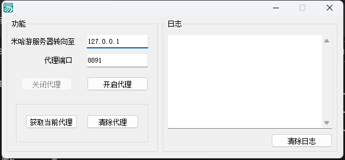

# 如何进入服务器

1. **打开软件“米哈游代理转向”** 
2. **在IP处输入 对应的IP** 
3. **点击 “开启代理”**
4. **打开原神即可**

**[文件下载](https://github.com/xiaoyuban1213/genshin-fabu/releases)

# 2.6以及老版本处理办法

[2.6客户端本体](https://autopatchcn.yuanshen.com/client_app/download/pc_zip/20220318210005_l9zBcCngXHqIrxpk/YuanShen_2.6.0.zip)  [2.6中文语音包](https://autopatchcn.yuanshen.com/client_app/download/pc_zip/20220318210005_l9zBcCngXHqIrxpk/Audio_Chinese_2.6.0.zip)

### 其他版本自己找去
